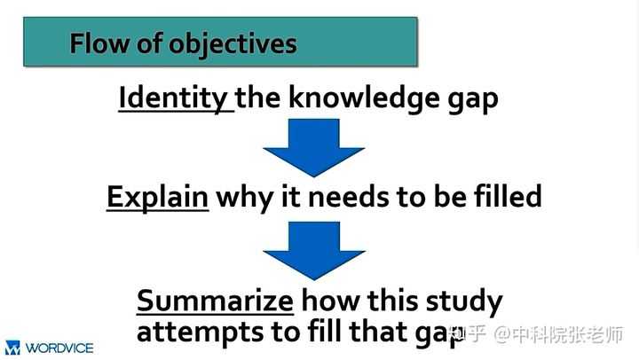

太久没用git，都不太记得如何使用了，重拾一下吧！用它记录一下论文撰写历程

改论文比写论文难多了，根本不愿动手动脑子，真是思想懒惰，正好借此督促一下自己

# 最主要的问题

T:大部分写的是叙述性的，不够主观：我的创新性是什么？

T:按提出了一个框架而非一个算法的思路写mixed quantization；给framework取个名字

T:用一般现在时，少部分用现在完成时

T:语法问题最后改

- [ ] 创新性体现够明显吗？①达到了最好的压缩和加速间的平衡②实现了pq的data-free③实验结果很好

  > - [ ] ①另一篇论文也实现了较好的效果，把他跟我们的结果对比一下
  > - [ ] ①还不太能放开夸自己，调整一下写作心态
  > - [ ] ②也没完全实现sq+pq的无数据化，表述时得谨慎一些
  > - [ ] ③写①时就需要数据支撑了，怎么把实验数据单独拎出来说呢

- [ ] 好难取名字

  > - [ ] ①算法一叫啥名
  > - [ ] ②算法二叫啥名
  > - [ ] ③整体的框架叫啥名？框架是指sq+pq还是sq+pq+datafree（田老师说的是sq+pq）

- [ ] 时态更改
- [ ] 语法问题：好的，最后再改

> 4.24周日

- [ ] 收集美观的流程图
- [x] zotero文章分类（打标签：sq、pq、datafree、剪枝）
- [ ] 复盘sq+pq的论文
- [x] introduction修改

# introduction

T:introduction 背景写的有点少，写一段；把后面introduction四块融合到related，哪些相关的研究有问题1，我们是怎么做的；哪些相关的研究有问题2，我们是怎么做的；综述我们的算法；我们的算法有哪些关键、详细的；结果一段→核心：引出我们的创新性

- [x] 研究背景还不够宽泛，未说清发展历程（引用该领域前人、大牛的经典文献或者奠基性著作）
- [ ] 没有写得很充分：哪些相关的研究有问题1，我们是怎么做的；哪些相关的研究有问题2，我们是怎么做的（可以增加一些引用，解决引用量的问题）→研究空白是什么？（“这个课题尚未被太多科研者涉足”云云）为什么要解决该空白？（能实现什么效果）我们是怎么解决的？（本文采用伪量化单元使sq和pq融合，使模型精度更高？考虑了其他sq和pq的融合（前人研究没有考虑但是这其实很重要）（可以与另一篇sq+pq的论文对比）？解决了pq的数据依赖问题？）
- [ ] 要完成上一点得再看看论文
- [x] 综述我们的算法，详细说一下我们的算法的关键点
- [x] 实验结果一段
- [ ] →核心：引出我们的创新性
- [ ] 创新性体现够明显吗？①达到了最好的压缩和加速间的平衡②实现了pq的data-free③实验结果很好

> - [ ] ①另一篇论文也实现了较好的效果，把他跟我们的结果对比一下
> - [x] ①还不太能放开夸自己，调整一下写作心态
> - [x] ②也没完全实现sq+pq的无数据化，表述时得谨慎一些
> - [ ] ③写①时就需要数据支撑了，怎么把实验数据单独拎出来说呢

> 4.25周一

- [x] 再改一遍introduction
- [ ] 做好文献整理工作
- [ ] 理一下datafree发展历程

> 4.26周二

- [x] 继续看datafree论文

- [x] 改related

- [x] 党组织生活会

  

> 4.27周三

- [ ] 上课
- [ ] 做ppt、改related

# related

T:related需要很多引用

T:标题写全；一个小标题一段；几个方法一起讲，讲一下优缺点，如果可以的话就讲一下自己的方法；第一段讲一下四个方法的内在联系

- [x] 田老师说第一段信息量不够，直接删掉！可是别的论文也这样写的耶！再看看论文，斟酌一下→改进：第一段讲一下四个方法的内在联系
- [x] 标题和图标都不能用缩写
- [x] 几个方法一起讲，讲一下优缺点，如果可以的话就讲一下自己的方法
- [x] 现在的引用数30+还不够，争取45+
- [ ] datafree部分重新构思一下（结构很清晰，但是zeroq似乎也这样写了）
- [ ] 多看一点datafree论文，理清发展逻辑，下周组会可以讲讲

> 4.28周四

- [ ] 构思一下method的框架
- [ ] 上课
- [ ] 写conclusion和abstract
- [ ] 如果能改完introduction、related，写完conclusion、abstract，就提前找田老师看一下论文，周五就能讨论讨论

> 4.29周五

- [ ] 准备组会
- [ ] 组会
- [ ] 跟田老师交流第三章的修改思路（可能还会交流introduction、related、conclusion、abstract）
- [ ] 问一下田老师绘图软件推荐（也可以问问其他人）
- [ ] 玩耍

> 4.30周六

- [ ] 看田老师怎么说

- [ ] 继续修改论文

# method

T:3.1 这样的框架可以适用于其他的标量+乘积量化；框架的模式→框架的第一部分+框架的第二部分+如何融合 3.2 framework  3.2.1能不能再少一点

- [ ] 框架名、算法名、标题名
- [ ] 重新整理一下论文逻辑框架：3.1 这样的框架可以适用于其他的标量+乘积量化；框架的模式→框架的第一部分+框架的第二部分+如何融合 3.2 framework
- [ ] 3.2.1能不能再少一点
- [ ] 重新绘图（好难，先再其他论文里找一些好看的图，再学学怎么绘制吧）
- [ ] 问一下田老师绘图软件推荐（也可以问问其他人）

# experiment

先按照我的安排写；消融实验

- [ ] 内容太多了，可咋整？这一章就写了6页
- [ ] 看一下其他的论文咋整的

# conclusion

# abstract

T:先写着

- [ ] 最后再写吧......

> [科研论文Introduction引言部分的作用 - 知乎 (zhihu.com)](https://zhuanlan.zhihu.com/p/33876355)
>
> 1.引言通常需要承接摘要部分提出的几个学术方向展开话题，**从比较宽泛的学术背景铺垫逐渐过渡到论文的研究课题**（narrow down to the research problem）。
>
> 2.Why An Introduction Is Needed？
> 「从文章的大结构来看**Introduction提出了你的研究问题，这个问题的答案应该在文章的Discussion或者Conclusion部分呈现给读者**，也就是在文章的首尾形成一个前后呼应的关系」。
>
> 3.引言部分需要解答两个核心问题：
>
> ①研究空白是什么？为什么我们要填补这个研究空白？(更加接地气地表达就是， **你要说服读者这个研究空白很重要值得我们费时费力去探究**)
> ②你的研究问题是什么？为什么你的研究问题可以填补这个研究空白？(更加接地气地表达就是，**你要说服读者相信你的研究的确填补了这个领域的空白**)
>
> 4.引言部分的逻辑架构
>
> 
>
> 
>
> 「Introduction的行文框架可以理解为一个“漏斗结构”，也是一个从较宽泛的学术领域逐渐缩小到你的研究目标的过程」
>
> 
>
> 5.核心内容
>
> ①研究背景和重要性
>
> - **Mention of previous work on the subject**
> - **A statement of the importance of the subject**
>
> 引言部分的第一段需要给出研究领域的大背景及其重要性所在。这个大背景勾勒出该领域科研成果从古至今的一个走向或者趋势 (what is known)，为接下来本论文课题的发展生长提供温床。这部分内容的展开一定要引用该领域前人、大牛的经典文献或者奠基性著作，体现你对于该学科的一个总体把握是全面且客观的。
>
> ②引出该领域科研空白
>
> * **Description of knowledge gap**
>
> 你论文课题研究的什么，此处就针对性地写“这个课题尚未被太多科研者涉足”云云。
>
> ③点题——指出本文的研究课题
>
> * **Announce the research topic/question being addressed in research paper**
>
> * **How it will fill the missing brick in the wall of research already done**
>
> 接下来就是你理直气壮陈述该论文主题的时刻，此时需要注意与研究空白的呼应，即在摆出课题是什么的基础之上更近一层，**简要分析这个课题是「如何填补了科研空白」的**。例如**本文采用的模型预测精度更高？或是考虑了某个影响因子（前人研究没有考虑但是该因子其实很重要）的作用？亦或是在不同的实验条件、实验地点得出了和其他科研论文不一样的结论？**这种 “进一步”的关联性分析往往是中国学生最喜欢忽略的。
>
> ④概述文章的核心方法论和主要发现（Highlight The Approach And Principal Findings）
>
> - **Description of your approach and why you chose it (if needed)**
> - **Brief summary of your major findings**
>
> 这部分的内容并不是每一个学科领域或者所有期刊都有要求。需要注意**一定要提出主要的研究手段(是什么以及为什么选择它)和研究发现，不要过分展开更不需谈及细节，精炼地点到为止即可**。
>
> ⑤提出猜想和研究目的（Hypothesis And Objectives）
>
> **提出对之前科研问题的猜想以及你通过这项科研课题的研究想要达到的研究目的（Objectives）**。研究目的可以依照文章的具体内容板块拆分成几个小点罗列出来。这种方式有点类似“节目预告”，给读者阅读后面的内容引路，一方面能够让读者明白后面内容的大致轮廓(Organization of this paper)，另一方面也能抓住读者的注意力继续循着你提供的线索和方向探究下去。
>
> 6.常见误区
>
> ①**「误区1」. 一个观点或者论据引用一大串文献 — Give too many citations for one point**
>
>  [4-15] 实在是太多了，堆砌在一个观点的后面是审稿人很反感的
>
> 不妨尝试改用下面的句式来展现 A significant association has been found between X and Y in men [4-7], women [8-11], and children [12-15].
>
> ②**「误区2」. 指出研究课题不具体说明到底如何有研究价值 — Explain why your research topic is worth of study**
>
> The development of new materials is **necessary** for the automotive industry **to produce stronger, lighter vehicles, which will improve safety and fuel economy**.**（推荐表达，加粗部分具体指明在哪几个点体现新材料的重要性）**
>
> ③**误区3」. 细节过多导致句子不够精炼 — Bury your readers in detail**
>
> 关于研究方法、研究结果只需要概述性地在引言部分点到为止即可，接下来的章节会给它们更多的空间去展开更具体的内容。
>
> 7.句型推荐 [英文论文Introduction写作误区和建议 - 知乎 (zhihu.com)](https://zhuanlan.zhihu.com/p/52494879)
>
> 
>
> **你发明了A方法解决B问题。如果B问题是已知的问题, 你就要解释为什么现在的解决方案都不好或者为什么还没有解决方案。如果B问题是未知问题、你自己发现的新问题，那么你就要解释这个问题有多重要**
>
> 关于Related work，在我自己的写作风格里，不是特别重要。**因为在问题的分析阶段，我肯定是要把非常相关的前人的论文并且逐一批判的，一般五六篇到十来篇吧**。一般是把一些不是特别相关的论文放到related work里面再分类讨论下，不会对整篇文章的逻辑构成很大的影响
>
> **在每一章的开头处用3-4句话总结这一章要说什么、把我的核心contribution列出来**
>
> intro和related work中提到的文献可以有重复，但别照搬

> **文章ABC开创了某个领域，DEF在这个问题领域提出了集中思路，GHI则是在各个思路下的改进**——那么我们就可以先说用总领的话来叙述ABC，然后用并列的方式讲DEF，最后可以一笔带过GHI（如果它们不是那么重要的话）
>
> 这些逻辑可能是并列的：例如文章ABC用了X技术来解决某个问题，DEF用了Y技术，而GHI则用了Z的技术——那么我们可以使用分条列举的方式，**先写”为了解决某个问题，大家采用了不同的方法“，然后列出1）X技术[ABC] 2）Y技术[DEF] 3) Z技术[GHI] **。这样把类似的文章集中起来，大家看着也顺溜。
>
> 还有些其他不怎么常见的逻辑顺序，比如分-总（例如先有零散的工作，后来有一篇文献把它们综合了起来）。但是当我们意识到文献内在的逻辑顺序，并且把它们按照逻辑列举出来的时候，就已经比许多论文的相关文献高出了不止一个档次：）
>
> 更加高级的写作方式，则是与其列举文献，更像是让文献为作者自己的陈述服务。你在阅读的过程中，很难感觉到作者在刻意塞进一些文献来充数；相反，作者是在整理自己的思路，顺便引用了关键的文献来加以佐证。一些好的例子可以参照[1,2,3]。
>
> 在你写完相关文献之后，可以**试着只阅读每个段落的第一句以及最后一句，看看能不能大致地掌握整个章节想表达的东西**。如果可以，那么你的过渡已经运用地炉火纯青了！
>
> **related work：字面意义上的相关工作(主要是相关工作以及intro或者下文会涉及到工作的介绍)，描述其他类似的工作，这个工作和其他这些工作不同点在哪里**
>
> **introduction是为了让读者对你的研究感兴趣，related work 作用则是让读者对你的研究放心—即证明下文的研究不是闭门造车，而是紧跟前沿，富有意义**。作者要把这个小领域以往相关的研究、热点问题、研究不足清晰地讲述出来，并告诉读者在这基础上自己继续做了什么工作，填补什么研究空白。
>
> 

