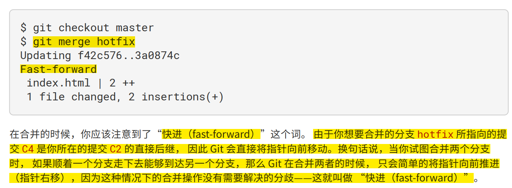
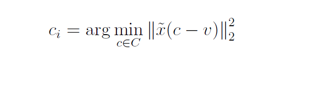

# 1.Git

## 常用指令

### 本地仓库

* 暂存`git add`

* 取消暂存`git reset HEAD <file>即文件名`

* 撤销修改`git checkout -- <file>`（须谨慎使用，因为它会删除在本地进行的所有修改）

* 检查状态`git status`

* 提交`git commit`

  

* 克隆`git clone 网址`

* 查看修改历史`git log`

### 远程仓库

* 查看远程仓库`git clone 网址`
* 读取远程仓库的简称和URL`git remote -v`
* 自行添加远程仓库`git remote add 简称 网址`
* 拉取远程仓库中有但本地没有的信息`git fetch 简称`（只会将数据下载到本地仓库，不会直接修改和更新，后续操作需要自己实现）
* 查看远程仓库信息`git remote show 简称`
* 远程仓库重命名`git remote rename 原名 新名`
* 移除远程仓库`git remote remove/rm 简称`（与其相关的远程跟踪分支和配置信息都会被删除）

### 打标签

* 查看所有标签`git tag (-l "v1.8*")`
* 创建轻量标签`git tag -a 标签名`
* 创建附注标签`git tag -a 标签名 -m 注释`
* 查看标签信息`git show 标签名`
* 补打标签`git tag -a 标签名 校验和/部分校验和`
* 查看校验和`git log --pretty=online`
* 共享标签`git push origin 标签名/--tags（很多标签）`
* 删除本地标签`git tag -d 标签名`（不会影响远程仓库，后续须手动更新）
* 更新远程仓库标签`git push 远程仓库名 :refs/tags/v1.4-lw`
* 删除远程仓库标签`git push 远程仓库名 --delete 标签名`
* 检出标签`git checkout 版本号`

### 分支

* 创建分支`git branch 分支名`（仅仅是创建新分支，不会自动跳到新分支）
* 查看各个分支当前所指的对象`git log --online --decorate (--graph --all)`
* 切换到已存在的分支`git checkout 分支名`（这样HEAD就指向该分支了）
* 创建并切换到新分支`git checkout -b 分支名`
* 合并分支`git merge 待合并分支名`（合并当前分支和待合并分支）
* 删除分支`git branch -d 分支名`


* 查看状态`git status`


* 使用图形化工具解决冲突`git mergetool`
* 查看分支情况`git branch`


* 查看分支合并情况`git branch --merged/--no-merged`（注：已合并到当前分支的可以直接删掉，未合并到当前分支的则须强制删除-如果需要的话）

## 思维导图


## 常用流程


## bug

* `fatal: unable to access 'https://github.com/yingqing0317/learn_git/': OpenSSL SSL_read: Connection was reset, errno 10054`

方法一：反复`git push 远程分支名 本地分支名`

方法二：[git设置代理 - 简书 (jianshu.com)](https://www.jianshu.com/p/7f1611823e00)

（注：Port=7890）

[(41条消息) github设置添加SSH_Kevin's Blog-CSDN博客_github添加ssh](https://blog.csdn.net/Aaron_Miller/article/details/90269019)


* 本地图片上传

[本地图片上传到GitHub，MarkDown使用Github图片地址 - Learning_more - 博客园 (cnblogs.com)](https://www.cnblogs.com/ghm-777/p/11433425.html)

实用：格式-图像-全局图像设置-...（直接在该文件夹创建一个images文件，一同上传到远程仓库）


# 2.Markdown


**加粗**

> 引用

[here][(41条消息) 本地git和远程github连接完整教程_一树荼蘼的博客-CSDN博客_连接github](https://blog.csdn.net/dgreh/article/details/83302358)

- [ ] 待办

```长代码/代码段```

`短代码`

:joy:表情（:<表情名称>:）


# 3.概念

## GUI

图形用户界面（Graphical User Interface，简称 GUI，又称图形用户接口）是指采用图形方式显示的计算机操作用户界面。

## Webhook

Webhook 就是一个接收 HTTP POST（或GET，PUT，DELETE）的URL，一个实现了 Webhook 的 API 提供商就是在当事件发生的时候会向这个配置好的 URL 发送一条信息，与请求-响应式不同，使用 Webhook 你可以实时接受到变化。

这又是一种对 `客户机-服务器` 模式的逆转，在传统方法中，客户端从服务器请求数据，然后服务器提供给客户端数据（客户端是在拉数据），在 Webhook 范式下，服务器更新所需提供的资源，然后自动将其作为更新发送到客户端（服务器是在推数据），客户端不是请求者，而是被动接收方；这种控制关系的反转可以用来促进许多原本需要在远程服务器上进行更复杂的请求和不断的轮询的通信请求；通过简单地接收资源而不是直接发送请求，我们可以更新远程代码库，轻松地分配资源，甚至将其集成到现有系统中来根据 API 的需要来更新端点和相关数据，唯一的缺点是初始建立困难。

### URL

统一资源定位系统（uniform resource locator;URL）是因特网的万维网服务程序上用于指定信息位置的表示方法。HTTP URL 方案是用来标志因特网上使用HTTP(HyperText Transfer Protocol，超文本传输协议)的可达资源。

* 我们在浏览器的地址栏里输入的网站地址叫做URL (Uniform Resource Locator，统一资源定位符)。
* 浏览器通过超文本传输协议(HTTP)，将Web服务器上站点的网页代码提取出来，并翻译成漂亮的网页

[HTTP协议和SOCKS5协议 - 尹正杰 - 博客园 (cnblogs.com)](https://www.cnblogs.com/yinzhengjie/p/7357860.html)


### HTTP请求

[(41条消息) HTTP请求的完全过程_ailunlee的博客-CSDN博客_http请求](https://blog.csdn.net/ailunlee/article/details/90600174)

### API

API（Application Programming Interface，应用程序接口）是一些预先定义的接口（如函数、HTTP接口），或指软件系统不同组成部分衔接的约定。用来提供应用程序与开发人员基于某软件或硬件得以访问的一组[例程](https://baike.baidu.com/item/例程/2390628)，而又无需访问源码，或理解内部工作机制的细节。

## 快照

快照指照相馆的一种冲洗过程短的照片·如：证件快照。基于硬件编程技术的一种，针对内存进行的快速读取技术，常用于硬件开发。

## TCP、UDP

[一文搞懂TCP与UDP的区别 - Fundebug - 博客园 (cnblogs.com)](https://www.cnblogs.com/fundebug/p/differences-of-tcp-and-udp.html)


## 服务器网卡

网卡，又称网络适配器或网络接口卡（NIC），英文名为Network Interface Card。在网络中，如果有一台计算机没有网卡，那么这台计算机将不能和其他计算机通信，它将得不到服务器所提供的任何服务了。当然如果服务器没有网卡，就称不上服务器了，所以说网卡是服务器必备的设备，就像普通PC（个人电脑）要配处理器一样。平时我们所见到的PC机上的网卡主要是将PC机和LAN（局域网）相连接，而服务器网卡，一般是用于服务器与交换机等网络设备之间的连接。


# 4.深度学习

## BN、ReLU与Conv融合

[神经网络量化入门--Folding BN ReLU - 知乎 (zhihu.com)](https://zhuanlan.zhihu.com/p/176982058)

* 如果使用 ReLU 之后的 scale 和 zp，那我们就可以用量化本身的截断功能来实现 ReLU 的作用。

注：ReLU 前后应该使用同一个 scale 和 zeropoint。这是因为 ReLU 本身没有做任何的数学运算，只是一个截断函数，如果使用不同的 scale 和 zeropoint，会导致无法量化回 float 域。

注：ReLU 本身就是在做 clip。所以，我们才能用量化的截断功能来模拟 ReLU 的功能。


# 5.mix_quantization

## 5.1 流程

### 5.1.1 kill-the-bits流程图


### 5.1.2 mix_quantization编程逻辑

> 我们在训练量化模型的时候:
>
> ①先是用的float的权值和激活，学习码本，这样float码本的精度更高，所以先是调用的pq
>
> ②然后用系数量化，量化权重（这里的权重是由码本恢复得来的）和激活，即float→int，也就是调用qat
>
> ③最后，用量化后的int权重和激活，微调码本

> 我们在测试的时候:
>
> ①权重由码本恢复，激活用系数量化为int
>
> ②wx+b后再反量化，得到float输出，作为下一层输入，以此类推

## 5.2 mix_quantization.py

Mixed Quantization (Fusion Quantization)

Step1: Acquire the codebook and index matrix using PQ

Step2: Insert presudo quantize unit and finetune the network recovered from codebook and indexmatrix.（伪量化应该是pseudo quantize？）（ 基于量化感知训练的误差校正算法的基本思想：向经过乘积量化后的近似网络中插入伪量化单元，模拟出量化反量化操作产生的误差，反向更新网络参数，消除量化误差。此处 ‘伪量化/量化感知训练/误差校正’是一体 ）


Step3: Finetune the whole network.

### 5.2.1 基础

* 导入包

* 设置GPU设备

  [(41条消息) os.environ["CUDA_DEVICE_ORDER"\] = "PCI_BUS_ID" os.environ["CUDA_VISIBLE_DEVICES"] = "0"_James_J的博客-CSDN博客](https://blog.csdn.net/Jamesjjjjj/article/details/83414680)

* `if __name__ == '__main__':    main()`

## 5.2.2 def parse_args(): # 命令行解析

[Python argparse的用法（运行时动态传参） - 知乎 (zhihu.com)](https://zhuanlan.zhihu.com/p/160242319)

> #导包
> import argparse
> #创建parser对象
> parser = argparse.ArgumentParser(...)
> #传参
> parser.add_argument(...)
> #创建读取对象
> args = parser.parse_args()
> #返回参数（进而读取参数）
> return args基础参数

* 乘积量化pq的参数
* 微调finetune的参数
* 量化感知训练error correction(QAT)的参数
  - [ ] 2、5000；weight_observer


### 5.2.3 def main():#主函数

* 基础设置

* `watcher`提取需要量化的层（对bias和bn差异性处理的原因？？？）

* 计算时间&空间利用情况

  - [ ] 如何计算

    

* `student、teacher`模型利用

  > 教师模型：未压缩模型。借鉴了蒸馏的思路。
  >
  > 学生模型：到当前层为止已压缩的模型
  >
  > 

* ```
  pesudo_quantization_layers = [] # 伪量化/量化反量化/量化感知训练
  for layer in layers:
  ```

  * STEP1：使用pq逐层量化网络
  * 获取须量化的激活值，并划分批次（激活值总数=每批次激活数*循环次数=batch_size * iter）
  * 获取权重矩阵并从计算图中分离它
  * 分配stride、padding值
  * 区分全连接层和卷积层的block大小

  - [x] Q：选择合适的质心数？如何挑选的？A：这个操作是为了限制中心向量的个数不要太大，我们程序里面一般就是输入值

  * 计算压缩比/索引矩阵、质心、码本、未量化层、量化层的存储大小、激活样本数
  * 乘积量化pq

  - [x] `if len(args.restart) > 0:`只量化未量化的层。

    > Q：如何通过restart判断是否量化？
    >
    > A：arg.restart就是训练的时候已经量化的层可以直接读出来，接着往后量化。主要是为了防止因为一些突发情况程序中断，可以接着训练，而不用重新开始。
    >
    > A：这个是参数，默认值是None，字符串类型的，输入的是一个路径，如果不输入就不用restart 。输入的路径：运行程序的时候通过命令参数输入，比如python mix_quantization.py --restart ./tmp

  * - [ ] 下载质心数和assignments（我居然忘了assignments是啥！！！好多参数还是不太明白是什么意思）

    * 量化权重矩阵

  * STEP2：QAT/微调码本

* STEP3：微调整个网络


- [ ] 丢失俩args.n_activations


- [ ] 讨论bn&bias

  A：提取卷积层的名字，排除bn&bias


* format()

format()功能更强大，该函数把字符串当成一个模板，通过传入的参数进行格式化，并且使用大括号‘{}’作为特殊字符代替‘%’

[python格式化输出之format用法 - lovejh - 博客园 (cnblogs.com)](https://www.cnblogs.com/lovejh/p/9201219.html)


* self.register_buffer()

PyTorch中定义模型时，有时候会遇到self.register_buffer('name', Tensor)的操作，该方法的作用是定义一组参数，该组参数的特别之处在于：模型训练时不会更新（即调用 optimizer.step() 后该组参数不会变化，只可人为地改变它们的值），但是保存模型时，该组参数又作为模型参数不可或缺的一部分被保存。

[PyTorch nn.Module中的self.register_buffer()解析 - 简书 (jianshu.com)](https://www.jianshu.com/p/12a8207149b0)


* 类(Class)

类(Class): 用来描述具有相同的属性和方法的对象的集合。它定义了该集合中每个对象所共有的属性和方法。对象是类的实例。

类变量：类变量在整个实例化的对象中是公用的。类变量定义在类中且在函数体之外。类变量通常不作为实例变量使用。

[Python入门之类(class) - chengd - 博客园 (cnblogs.com)](https://www.cnblogs.com/chengd/articles/7287528.html)


* `nn.parallel.DataParallel()`

公司配备多卡的GPU服务器，当我们在上面跑程序的时候，当迭代次数或者epoch足够大的时候，我们通常会使用nn.DataParallel函数来用多个GPU来加速训练。一般我们会在代码中加入以下这句：

```text
device_ids = [0, 1]
net = torch.nn.DataParallel(net, device_ids=device_ids)
```

DataParallel 会自动帮我们将数据切分 load 到相应 GPU，将模型复制到相应 GPU，进行正向传播计算梯度并汇总。

[Pytorch的nn.DataParallel - 知乎 (zhihu.com)](https://zhuanlan.zhihu.com/p/102697821)


* `torch.nn.Parameter()`

`self.v = torch.nn.Parameter(torch.FloatTensor(hidden_size))`

可以把这个函数理解为类型转换函数，将一个不可训练的类型`Tensor`转换成可以训练的类型`parameter`并将这个`parameter`绑定到这个`module`里面(`net.parameter()`中就有这个绑定的`parameter`，所以在参数优化的时候可以进行优化的)，所以经过类型转换这个`self.v`变成了模型的一部分，成为了模型中根据训练可以改动的参数了。使用这个函数的目的也是想让某些变量在学习的过程中不断的修改其值以达到最优化。


* `torch.cat()`

`torch.cat(inputs, dimension=0) → Tensor`

torch.cat() – 在给定维度上对输入的张量序列seq 进行连接操作,可以看做 torch.split() 和 torch.chunk()的反操作
inputs (sequence of Tensors) – 可以是任意相同Tensor 类型的python 序列
dimension (int, optional) – 沿着此维连接张量序列。


* `torch.norm`

[(41条消息) torch.norm的理解_goodxin_ie的博客-CSDN博客_torch。norm](https://blog.csdn.net/goodxin_ie/article/details/84657975)

`torch.norm(input, p, dim, out=None,keepdim=False) → Tensor`

返回输入张量给定维`dim` 上每行的p 范数。


* `lambda argument_list : expression`  

[(41条消息) 关于Python中的lambda，这篇阅读量10万+的文章可能是你见过的最完整的讲解_测试不将就-CSDN博客_lambda python](https://blog.csdn.net/zjuxsl/article/details/79437563?ops_request_misc=%7B%22request%5Fid%22%3A%22164627378116781685351957%22%2C%22scm%22%3A%2220140713.130102334.pc%5Fall.%22%7D&request_id=164627378116781685351957&biz_id=0&utm_medium=distribute.pc_search_result.none-task-blog-2~all~first_rank_ecpm_v1~rank_v31_ecpm-1-79437563.pc_search_result_cache&utm_term=lambda&spm=1018.2226.3001.4187)

return lambda x, y: x+y返回一个加法函数。这时，lambda函数实际上是定义在某个函数内部的函数，称之为嵌套函数，或者内部函数。对应的，将包含嵌套函数的函数称之为外部函数。


* `map()`


* `np.argmin()`

  


* 


## 5.3 pq

各个参数：

* in_activations=C_in * n_samples
* n_activations没有用到
* n_samples是pq在求loss的时候需要激活值x，这个n_samples就是x的采样数
* 


### 5.3.1 pq.y

* sample_activations、sample_weights

> 这俩就是采样用的，因为全部计算的话，计算量太大
>
> 激活值是C x H x W，我们对它采样，只抽取n_sample x H x W

* encode、decode

> encode就是学习中心向量的过程
>
> decode是将中心向量复原成权值矩阵


### 5.3.2 distance.py

distances.py是计算复原矩阵和原矩阵的距离（其实是向量的距离）。具体过程：先展开，再对每个展开式求误差的平方。实现的是：



这里原作者用的broadcasting来实现的，LMY学长：我现在也没搞太懂，为啥有效。


作者说这样更有效，更算得更快。LMY学长：我还没搞懂。


## 5.4 utils

### 5.4.1 watcher.py

> watcher：监测并存储激活值（主要是需要量化的激活值）（BN不需要monitor）
>
> - [x] 所有的前向传播和反向传播都要用到激活值，都要用watcher&hook提取&保存
>
> - [x] 一层量化层对应一个watcher
>
> - [x] watch就是在网络前向推理的过程中插入一个hook函数，然后在这个hook函数里面保存中间激活值，以备后面使用
>
> - [x] unwatch和remove的操作是防止后面测试的时候又调用这个hook函数（hook函数只需要调用一次）
>
>   
>


- [ ] `layers = [k[:k.rfind(".")] for k in keys if 'bias' not in k]`

> 学长：把模型所有层的名字提取出来
>
> 猜测：
>
> k取字符串 . 最后出现处的k值，且①从keys中依次查找②k不包括bias

- [ ] `if 'bias' in k`
- [ ] `if 'weight' in k`


- [ ] `M = attrgetter(layer + '.weight.data')(student).detach()`

> `attrgetter()对自定义对象排序`
>
> f = attrgetter(‘name’)，调用 f(b) 返回 b.name
>
> `detach()` 截断反向传播的梯度流
>
> 学长：把它对应的参数权重摘出来。具体是：attrgetter是把模型student里面的一个名字为weight.data的tensor复制出来，detach在这里是复制作用。
>
> 猜测：按layer排序，并且每层layer的参数权重都会被摘出来


> rfind() 查找子串最后一次出现的位置，如果查找的子串不存在，则返回-1*


> hook:
>
> 为了节省显存（内存），pytorch在计算过程中不保存中间变量，包括中间层的特征图和非叶子张量的梯度等。有时对网络进行分析时需要查看或修改这些中间变量，此时就需要注册一个钩子（hook）来导出需要的中间变量。
>
> [(36条消息) 【pytorch学习】四种钩子方法（register_forward_hook等）的用法和注意点_Brikie的博客-CSDN博客__forward_pre_hooks](https://blog.csdn.net/Brikie/article/details/114255743?spm=1001.2101.3001.6661.1&utm_medium=distribute.pc_relevant_t0.none-task-blog-2~default~CTRLIST~default-1.pc_relevant_paycolumn_v2&depth_1-utm_source=distribute.pc_relevant_t0.none-task-blog-2~default~CTRLIST~default-1.pc_relevant_paycolumn_v2&utm_relevant_index=1)
>
> 钩子函数、注册函数、回调函数，他们的概念其实是一样的。
>
> 
>
> [(59 封私信 / 16 条消息) 回调函数（callback）是什么？ - 知乎 (zhihu.com)](https://www.zhihu.com/question/19801131)


> 

- [ ] 未保存中间变量，那怎么用hook导出呢？
- [ ] `self._watch`
- [ ] `if __name__ == "__main__":    main()`


> detach() 截断反向传播的梯度流
>
> [(41条消息) Pytorch入门学习（九）---detach()的作用（从GAN代码分析)_my-GRIT的博客-CSDN博客_detach的作用](https://blog.csdn.net/qq_39709535/article/details/80804003)


